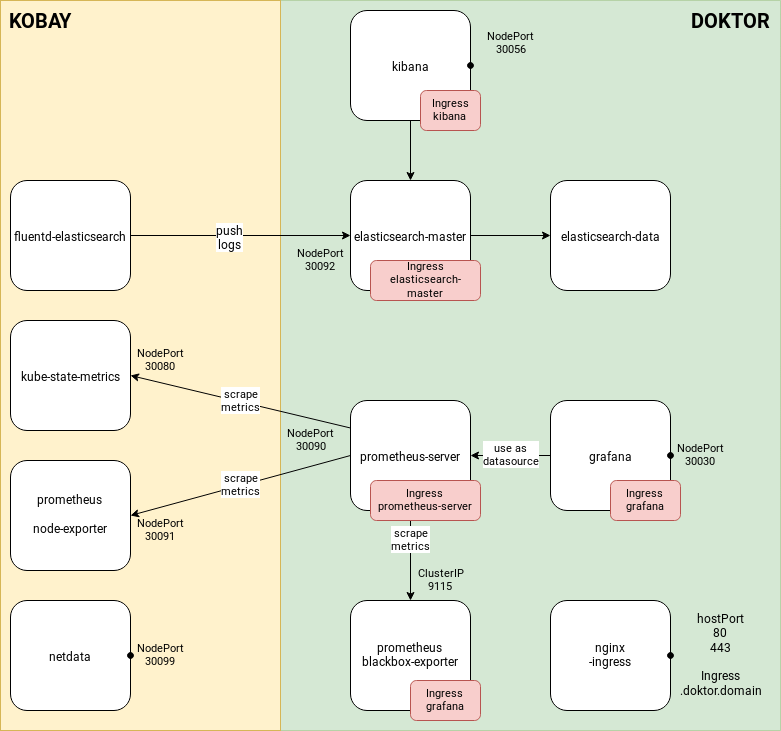

# KODO (kobay-doktor)

The objective of this repo is to automatically customize
helm charts based on terraform outputs and automatically
deploy the customized helm charts.

In order to deploy the helm charts, the `kodo.py` script
leverages [FairwindsOps/reckoner](https://github.com/FairwindsOps/reckoner).
Reckoner allows one to install and manage multiple Helm
chart releases defined in a yaml file call `course file`.

:warning: There is an ongoing effort to support `helm3` but this repo
has been tested with `helm2` only.

The following helm charts will be deployed:

Kobay cluster:
* fluentd (logging)
* node-exporter (monitoring)
* kube-state-metrics (monitoring)
* metrics-server (monitoring)

Doktor cluster:
* local-path-provisioner
* nginx-ingress
* EFK
* Prometheus/Grafana
* Prometheus Blackbox Exporter
* metrics-server (monitoring)


# Overview




## Requirements

* Python 3
* Helm 2
* Reckoner (current version 2.2.0)


## Options

* General arguments:

Flags	|	Environment variable	|	Default value	|	Description
---	|	---	|	---	|	---
--doktor-domain	|	DOKTOR_DOMAIN	|	None	|	Must be a wildcard DNS pointing to a worker on the Doktor cluster where the services are exposed e.g: 192.168.1.1.omg.howdoi.website


* Arguments for subcommand `kobay`:

Flags	|	Environment variable	|	Default value	|	Description
---	|	---	|	---	|	---
--reckoner-course-file	|	KOBAY_RECKONER_COURSE_FILE	|	./kobay.yaml	|	Kobay reckoner course file path
--kubeconfig	|	KOBAY_KUBECONFIG	|	None	|	Kobay kubeconfig path


* Arguments for subcommand `doktor`:

Flags	|	Environment variable	|	Default value	|	Description
---	|	---	|	---	|	---
--reckoner-course-file	|	DOKTOR_RECKONER_COURSE_FILE	|	./doktor.yaml	|	Doktor reckoner course file path
--kubeconfig	|	DOKTOR_KUBECONFIG	|	None	|	Doktor kubeconfig path
--kobay-tfstate	|	KOBAY_TFSTATE	|	None	|	Path to the state file of the Kobay cluster to read
--cap-test-app-url	|	CAP_TEST_APP_URL	|	None	|	URL of the test app deployed on CAP


## Usage

Export minimum required variables:

* Related to **Kobay**

```bash
export KOBAY_KUBECONFIG=~/terraform-kobay/my-cluster/admin.conf
export DOKTOR_KUBECONFIG=~/terraform-doktor/my-cluster/admin.conf
export CAP_TEST_APP_URL=http://192.168.10.117.omg.howdoi.website
```

* Related to **Doktor**

```
export KOBAY_TFSTATE=~/terraform-kobay/my-cluster/terraform.tfstate
export DOKTOR_DOMAIN=192.168.11.200.omg.howdoi.website
```


Customize the helm charts:

```bash
./kodo.py kobay customize
./kodo.py doktor customize
```


Deploy the helm charts:

```bash
./kodo.py kobay deploy
./kodo.py doktor deploy
```
